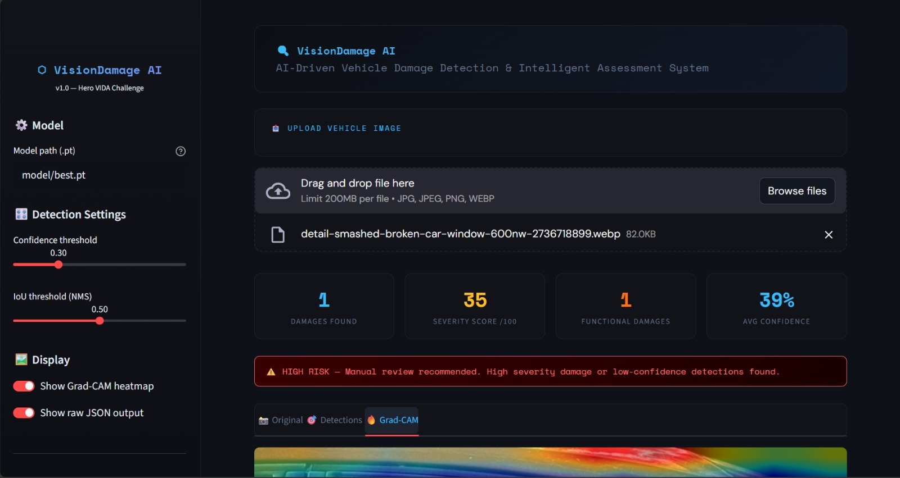
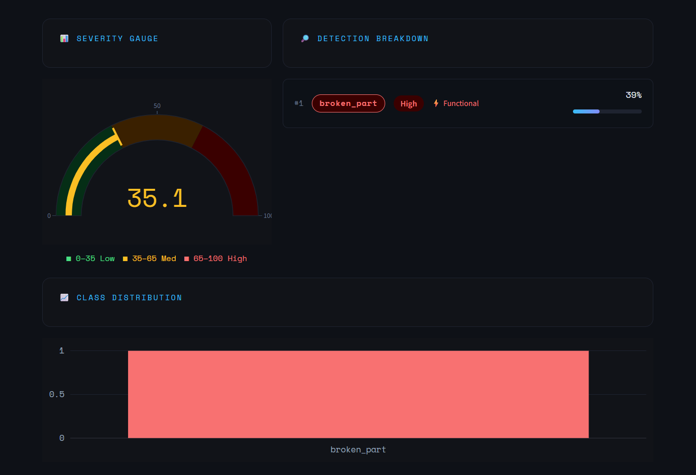

# VisionDamage AI - Vehicle Damage Detection

VisionDamage AI is a Streamlit-based computer vision application that detects visible damage on vehicle images and turns the result into an easy-to-understand assessment report. The app is designed for fast inspection workflows where a user can upload a vehicle photo, view detected damage areas, understand the estimated severity, and download a structured JSON report.

The project was built for the Hero VIDA Challenge / hackathon context, with the larger idea of making vehicle damage inspection quicker, more transparent, and less dependent on manual first-level checks.



## Introduction

Vehicle damage inspection is often slow, manual, and subjective. A small scratch, dent, broken part, or paint damage may need to be checked, categorized, documented, and reviewed before any next step can be taken.

VisionDamage AI helps simplify this process by using an object detection model to identify common vehicle damage types from an uploaded image. It then displays the detected regions with bounding boxes, calculates an approximate severity score, flags high-risk cases, and provides a downloadable machine-readable report.

The aim is not to fully replace human inspection, but to support it by giving a fast and consistent first-level assessment.


## Key Features

- Upload vehicle images in JPG, JPEG, PNG, or WEBP format.
- Detect multiple damage types in a single image.
- Draw bounding boxes around detected damage areas.
- Classify damage into categories such as scratch, dent, broken part, and paint damage.
- Show confidence score for each detection.
- Estimate severity as Low, Medium, or High based on detected damage area.
- Calculate an overall severity score from 0 to 100.
- Separate cosmetic damage from functional damage.
- Highlight high-risk cases that may need manual review.
- Display a Grad-CAM style heatmap to show where the model is focusing.
- Show class distribution using charts.
- Generate and download a JSON damage report.
- Provide adjustable confidence and IoU thresholds from the sidebar.

## Model Used

This project uses a YOLOv8 object detection model through the `ultralytics` library.

The trained model file should be placed inside the `model/` folder as:

```text
model/best.pt
```

The model is expected to detect the following classes:

| Class | Meaning | Impact Type |
| --- | --- | --- |
| `scratch` | Surface-level scratches or scrape marks | Cosmetic |
| `dent` | Depressed or bent body panels | Cosmetic |
| `broken_part` | Broken or missing vehicle components | Functional |
| `paint_damage` | Paint peeling, chipping, or visible paint loss | Cosmetic |

The app uses the trained YOLO model for inference and then adds post-processing logic for severity, impact type, risk flagging, and report generation.



## Tech Stack

| Area | Technology |
| --- | --- |
| Frontend / App UI | Streamlit |
| Object Detection | YOLOv8, Ultralytics |
| Deep Learning | PyTorch, TorchVision |
| Image Processing | OpenCV, Pillow, NumPy |
| Visualization | Plotly, Matplotlib |
| Report Format | JSON |
| Language | Python |

## How It Works

1. The user uploads a vehicle image through the Streamlit interface.
2. The app loads the trained YOLOv8 model from `model/best.pt`.
3. The uploaded image is passed to the model for damage detection.
4. Detected objects are converted into a structured list with class name, confidence score, bounding box, severity, and impact type.
5. The app draws bounding boxes on the image and displays the result.
6. A Grad-CAM style heatmap is generated to visualize model attention.
7. The severity score and high-risk flag are calculated.
8. The final report can be viewed in the app or downloaded as a JSON file.

## Project Structure

```text
Vehicle Damage Detection/
|-- app.py                  # Streamlit dashboard and user interface
|-- requirements.txt        # Python dependencies
|-- packages.txt            # System packages for deployment environments
|-- README.md               # Project documentation
|-- model/
|   `-- best.pt             # Trained YOLOv8 model weights
|-- utils/
|   `-- detector.py         # Model loading, inference, Grad-CAM, and severity logic
|-- test images/
|   `-- sample images       # Optional local images for testing
```

## Setup and Installation

### 1. Clone or Open the Project

```bash
git clone <your-repository-url>
cd "Vehicle Damage Detection"
```

If the project is already on your system, open the project folder directly.

### 2. Create a Virtual Environment

```bash
python -m venv venv
```

### 3. Activate the Virtual Environment

For Windows:

```bash
venv\Scripts\activate
```

For macOS / Linux:

```bash
source venv/bin/activate
```

### 4. Install Dependencies

```bash
pip install -r requirements.txt
```

### 5. Add the Trained Model

Create a `model/` folder if it does not already exist, then place your trained YOLO weights inside it:

```text
model/best.pt
```

### 6. Run the App

```bash
streamlit run app.py
```

After running the command, Streamlit will open the app in your browser.

## How to Use

1. Start the app with `streamlit run app.py`.
2. Check the model path in the sidebar. By default, it is `model/best.pt`.
3. Adjust the confidence threshold or IoU threshold if needed.
4. Upload a vehicle image.
5. View the original image, detection output, and Grad-CAM heatmap.
6. Check the damage breakdown, severity score, and risk flag.
7. Download the JSON report for documentation or further processing.


## Output Report

The app produces a JSON report with information like:


This makes the output useful not only for visual inspection, but also for integration with claim systems, service dashboards, or backend workflows.

## Challenges I Faced

- Getting reliable damage detection across different vehicle angles, lighting conditions, and image qualities.
- Handling multiple damage types that can look visually similar, such as scratches and paint damage.
- Making the output understandable for both technical and non-technical users.
- Converting raw model predictions into a practical severity score.
- Balancing confidence thresholds so the app does not miss real damage or show too many false detections.
- Keeping the dashboard clean while still showing useful details like heatmaps, charts, confidence scores, and JSON output.
- Making the project easy to run locally with a simple setup process.

## End Goal

The end goal of VisionDamage AI is to create a fast, accessible, and explainable vehicle damage assessment tool that can support:

- vehicle service centers,
- insurance claim verification,
- rental or fleet inspection,
- EV/scooter damage checks,
- customer self-inspection workflows,
- and automated first-level damage reporting.

In a real-world version, this system could help reduce inspection time, improve consistency, and provide a digital record of vehicle damage before human review.

## Future Improvements

- Train the model on a larger and more diverse vehicle damage dataset.
- Add support for video-based inspection.
- Add automatic repair cost estimation.
- Store inspection history in a database.
- Add user authentication for service centers or companies.


## Quick Command Summary

```bash
python -m venv venv
venv\Scripts\activate
pip install -r requirements.txt
streamlit run app.py
```

## Author Note

This project is a practical attempt to combine computer vision, explainable AI, and a clean user interface for solving a real inspection problem. It focuses on making AI output easier to understand, verify, and use in real decision-making workflows.
